# Office365StatusZabbix
Monitorar o status dos serviços do Office 365 com o Zabbix.

Para verificarmos o status dos serviços basta acessar a URL: https://portal.office.com/servicestatus

	

Porem precisamos verificar a URL que esta página consome, para isto, clique com o botão direito em <b>Inspecionar</b> e depois aperte <b>F5</b> para que a página volte a carregar.

	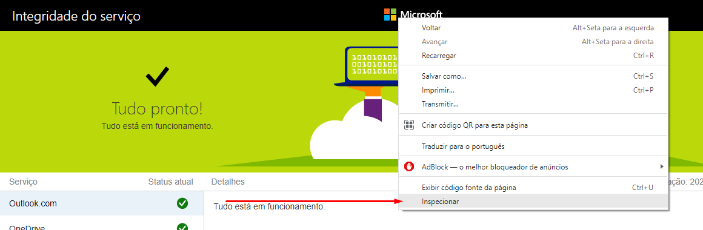

Com isso veremos uma item chamado <b>index</b> não <b>index.html</b>.
Clique em cima dele com o botão direito e depois em cima de  Copy</b> e depois em <b>Copy link address</b>

	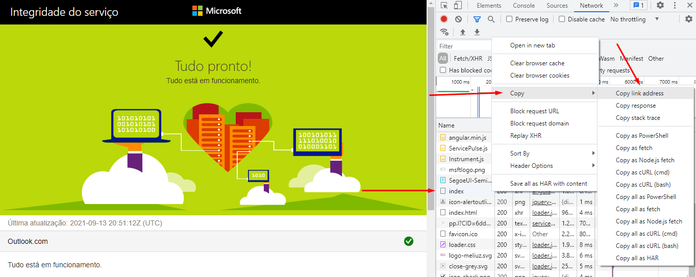

Cole essa URL https://portal.office.com/api/servicestatus/index no browser e verá que irá carregar uma página em JSON.

	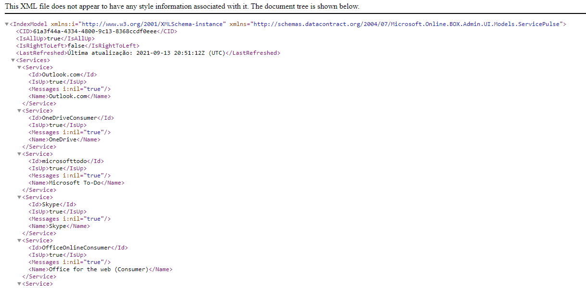

Aqui um exemplo do JSON retornado no CMD.

	

Copie esse JSON e cole por exemplo no JSON Formatter https://jsonformatter.curiousconcept.com/# para deixa-lo melhor para visualizar.

	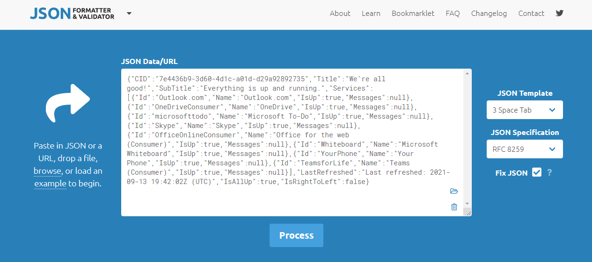

Copie o resultado já formatado.

	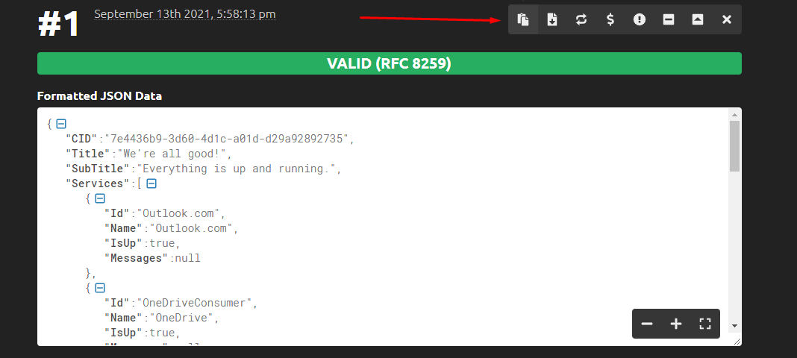

Cole no JSON Path http://jsonpath.com/ e na syntax veja como parsear somente o que desejar. Neste caso iremos parsear apenas os nomes.
<b>$.Services..Name</b>
O retorno é todas as posições name dentro do Array Services.

	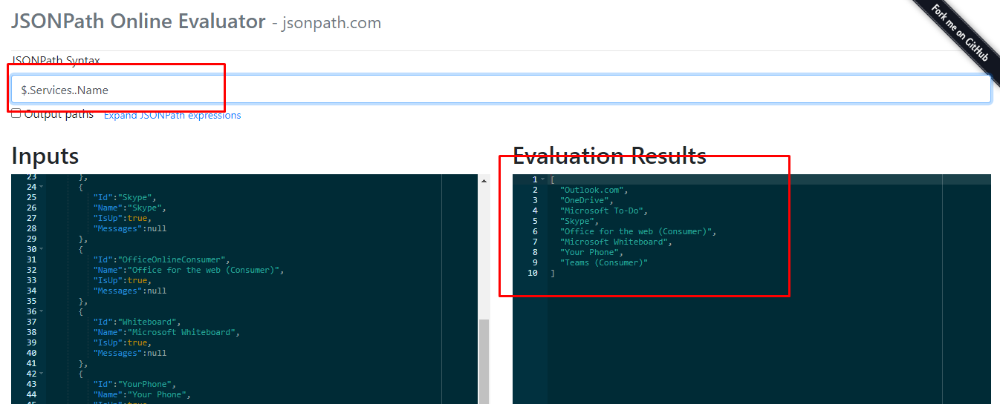

	
Uma forma de pegar apenas um item em vez do array todo é selecionar a posição dele dentro do Array, desta forma basta passar a posição dele dentro do syntax.
<b>$.Services..[1]Name</b>
Neste caso o retorno é apenas <b>OneDrive</b> dentro do Array Services.

	

	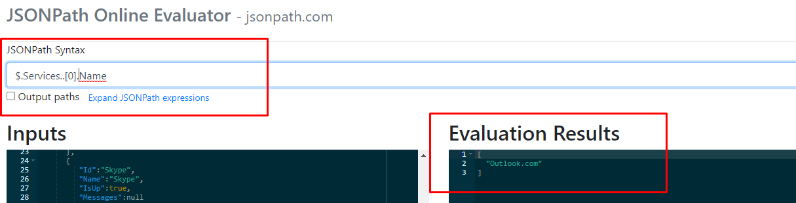

E caso queira verificar se ele está Up ou não basta filtrar no syntax apenas o <b>IsUp</b>
<b>$.Services..[1]IsUp</b>
Neste caso o retorno é apenas o status do <b>OneDrive</b> (true) dentro do Array Services.

	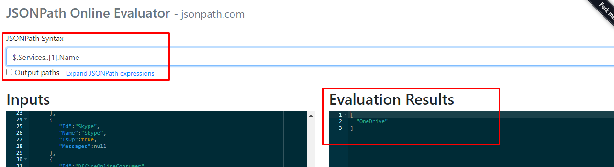

Com essas informações agora podemos montar os sensores no Zabbix.
Criamos um host chamado <b>Office 365 Status</b>.

	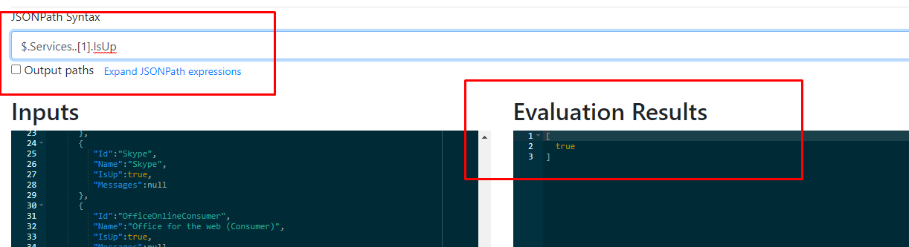

Vamos explicar a criação dos itens exemplificando o item <b>Outlook</b>.
<b>Name</b> -> Outlook.com
<b>Type</b> -> HTTP agent
<b>Key</b> -> outlook
<b>URL</b> -> https://portal.office.com/api/servicestatus/index

	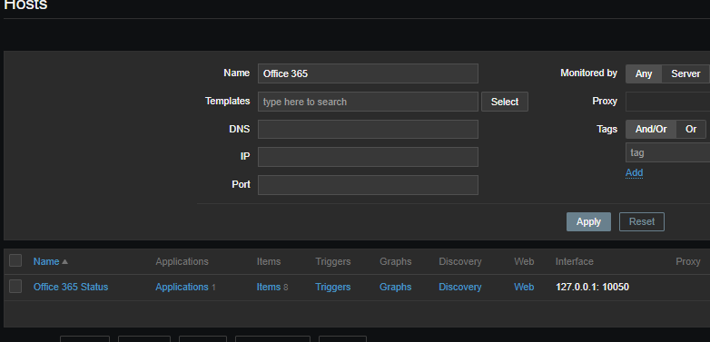

E em Preprocessing devemos adicionar dois steps.
O primeiro é <b>JSONPath</b>.
Com o parâmetro $.Services.[0].IsUp (É o valor de up ou dão do Outlook (Posição 0 do Array Services)).

	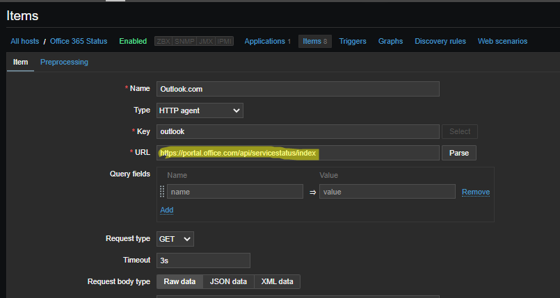

E o segundo step é <b>JavaScript</b> para transformar o texto true em um número para facilitar na criação de triggers.
O script é esse:

if (/true/.test(value)) {
    return(1)
}else{
      return(0)
  }
}

	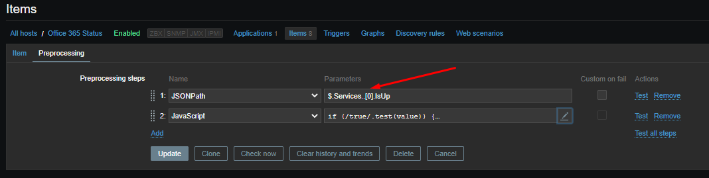

Feito tudo isso o monitoramento estará completo e respondendo!

	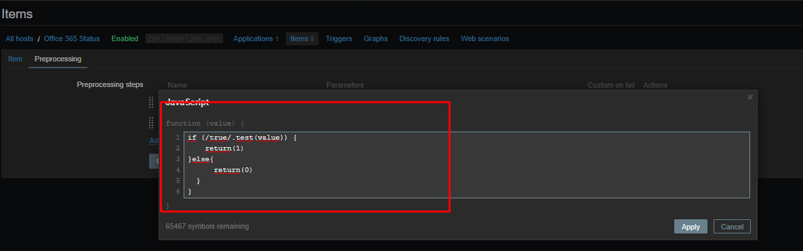

	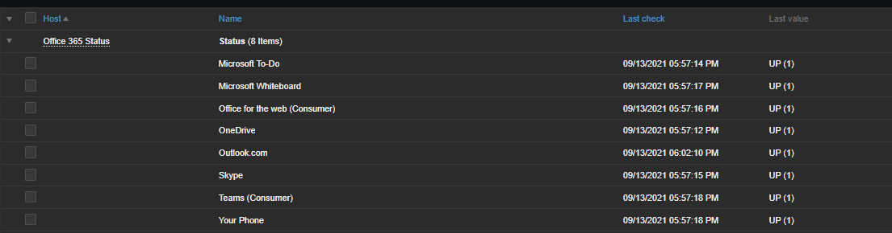

